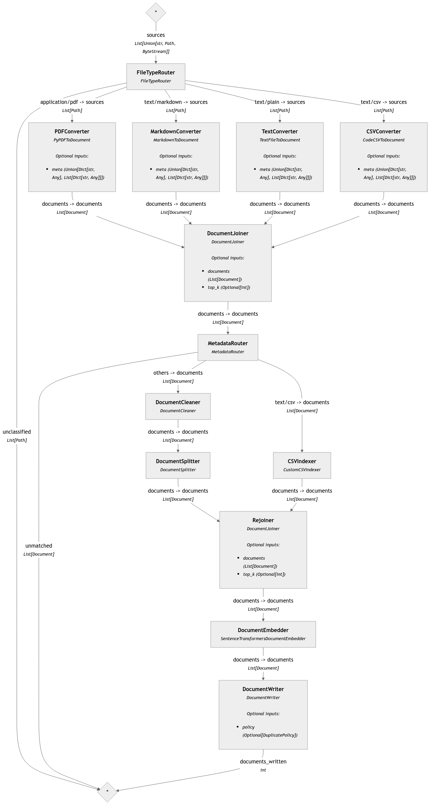

# Retrieval Augmented Generation with the Point Cloud Library
The goal of this project is to provide a RAG chatbot for advanced search in software documentations such as the doxygen documentation of the [Point Cloud Library](https://pointclouds.org/documentation/).

## Setting up environemnt:
1. install poetry via pip:
```bash
pip install poetry
```

2. install dependencies from repository root
```bash
poetry install
```

3. Setup environment variables for tracing via Langfuse
```bash
echo "export LANGFUSE_SECRET_KEY=<your-secret-key> >> ~/.bashrc"
echo "export LANGFUSE_PUBLIC_KEY=<your-public-key> >> ~/.bashrc"
```

4. Install ollama:
```bash
curl -fsSL https://ollama.com/install.sh | sh
```

## Running the RAG app
1. Pull the latest version of llama3.1
```bash
ollama pull llama3.1
```

2. Start your local qdrant instance
```bash
docker run -p 6333:6333 -p 6334:6334 \
    -v /path/to/local/qdrant_storage:/qdrant/storage:z \
    qdrant/qdrant
```

3. From the `src` folder of the repository, run the app:
```bash
streamlit run main.py
```

4. An instance of your browser should open, to look something like this:


## Pipeline overview

