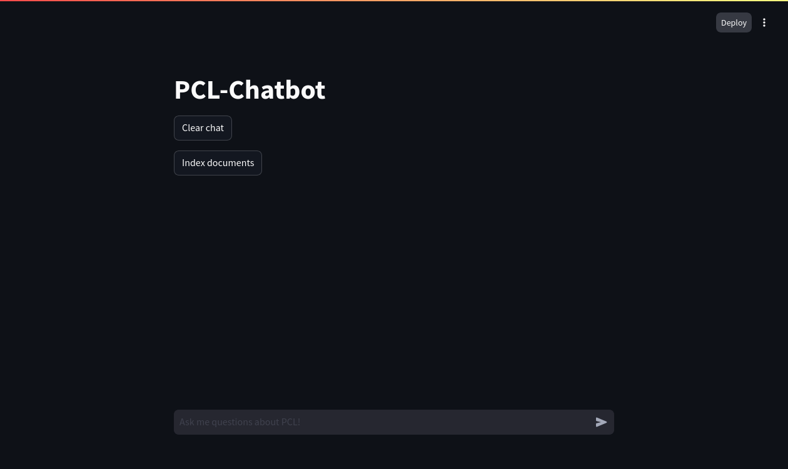

# ToDo's

- Scraping
	- Scraped Website
		- https://pointclouds.org/documentation/
		- Backup Seite: https://pandas.pydata.org/docs/development/index.html#development
	- Indexing levels
		- Modules > Class > Member Functions/Attributes > Definition (Code Segment)
		- Modules > Functions > Definition (Code Segment)
- Indexing
	- Big to Small Chunking
- Pipeline
	- User umschreibt Problem
	- LLM generiert Fragestellung
	- Contriever findet relevante Funktionen
	- LLM generiert Antwort mit Quelle
	- Random Markdown Datei zum testen

## Setting up environemnt:
1. install poetry via pipx:
```bash
pip3 install pipx
pipx install poetry
```

2. install dependencies from repository root
```bash
poetry install
```

3. Setup environment variables for tracing via Langfuse
```bash
echo "export LANGFUSE_SECRET_KEY=<your-secret-key> >> ~/.bashrc"
echo "export LANGFUSE_PUBLIC_KEY=<your-public-key> >> ~/.bashrc"
```

4. Install ollama:
```bash
curl -fsSL https://ollama.com/install.sh | sh
```

## Running the RAG app
1. Pull the latest version of llama3.1
```bash
ollama pull llama3.1
```

2. Start your local qdrant intance
```bash
docker run -p 6333:6333 -p 6334:6334 \
    -v ~/qdrant_storage:/qdrant/storage:z \
    qdrant/qdrant
```

3. From the `src` folder of the repository, run the app:
```bash
streamlit run main.py
```

4. An instance of your browser should open, to look something like this:
